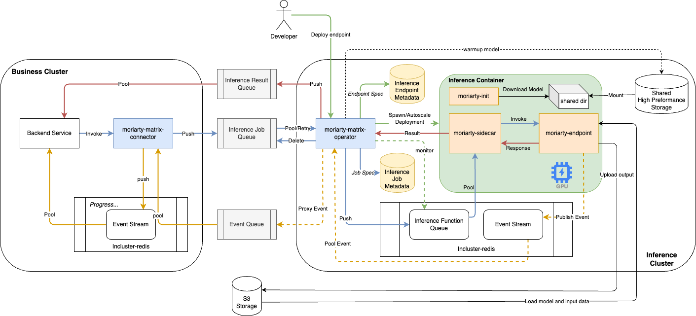

[](https://codecov.io/gh/Wh1isper/moriarty)

# moriarty

Moriarty is a set of components for building asynchronous inference cluster.

Relying on cloud vendors or self-built global queue services, asynchronous inference clusters can be built without exposing ports to the public.

## Why asynchronous inference, why moriarty?

- Preventing client timeout.
- Avoid HTTP disconnection due to network or other issues.
- Reducing HTTP queries with queues.
- Deploy on Multi/Hybrid/Private cloud, even on bare metal.

## Alternatives

This project came from my deep use of [Asynchronous Inferenc for AWS Sagemaker](https://docs.aws.amazon.com/sagemaker/latest/dg/async-inference.html), and as far as I know, only AWS and Aliyun provide asynchronous inference support.

For open source projects, there are many deployment solutions, but most of them are synchronous inference (based on HTTP or RPC).I don't find any alternative for async inference. Maybe Kubeflow pipeline can be used for asynchronous inference. But without serving support(Leave model in GPU as a service, not load per job), there is a significant overhead of GPU memory cache and model load time.

## Architecture Overview



Key Components:

- Matrix: single producer, multiple consumers. `Connector` as producer, provide HTTP API for _Backend Service_ and push invoke request to the global **Job Queue**. `Operator` as consumer, pull tasks from the **Job Queue** and push them to local queue. Pulling or not depends on the load of inference cluster. And also, `Operator` will autoscale inference container if needed.
- Endpoint: Deploy a function as an HTTP service.
- Sidecar: Proxy and transform queue message into HTTP request.
- Init: Init script for inference container

CLIs:

- `moriarty-matrix`: Manager matrix components
- `moriarty-operator`: Start the operator component
- `moriarty-connector`: Start the connector component
- `moriarty-sidecar`: Start the sidecar component
- `moriarty-deploy`: Request `operator`'s API or database for deploy inference endpoint.

## Install

`pip install moriarty[matrix]` for all components.

Or use docker image

`docker pull wh1isper/moriarty` or `docker pull ghcr.io/wh1isper/moriarty`

> `docker pull wh1isper/moriarty:dev` for developing version

## Develop

Install pre-commit before commit

```
pip install pre-commit
pre-commit install
```

Install package locally with test dependencies

```
pip install -e .[test]
```

Run tests with pytest

```
pytest -v tests/
```
